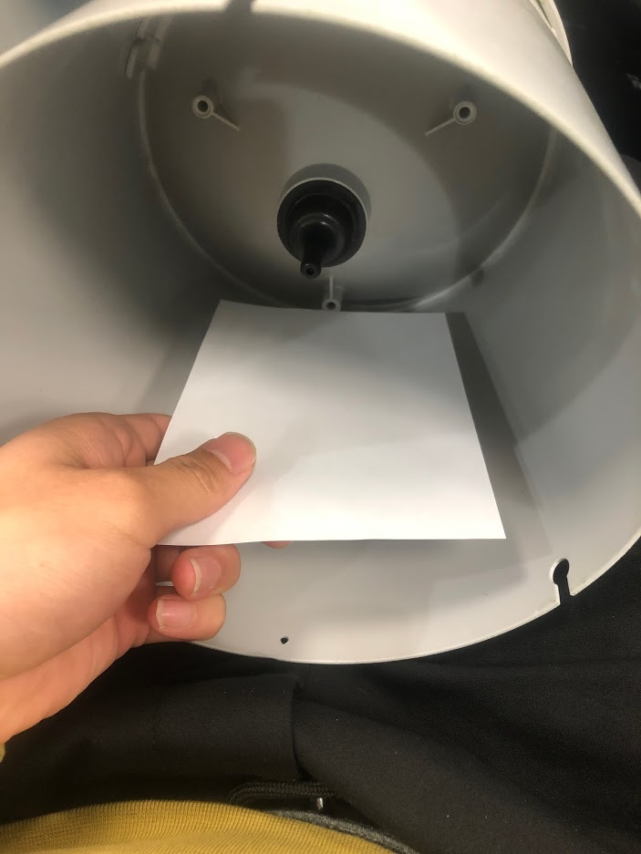
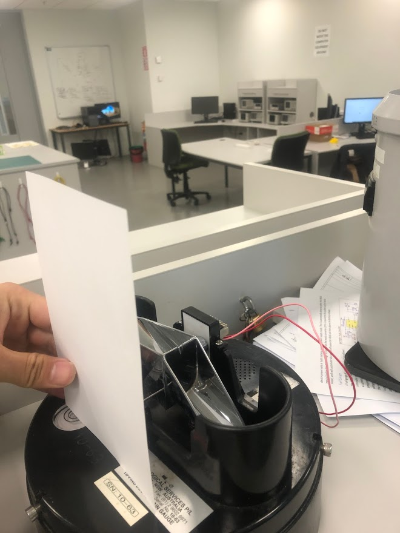

# Requirements

This document is about the requirements for the Rev 3.0 prototype.

- Improve power efficiency

  - All in one PCB (merge base board and extension board)
  - Use a different 12V to 5V regulator (TPS562201DDCR)
  - Upper limit of the current draw of the whole system is 8.2 mA

- Improve ease of use

  - Use fuel gauge IC to monitor battery state of charge (bq34z110)
  - Change though holes components (Inductors,RGB LEDs, hall effect sensors etc) to surface mount as well as ESP32 microcontroller
  - Use USB to UART interface for programming and debugging the ESP32

- Old problems to fix

  - Fix the reverse polarity protection (currently not working properly)
  - Fix the PCB layout of the power terminals (currently positive and negative labels are inverted)

- Environment Data

  - Water level, flow sensor
    - SDI-12 interface
    - Powered by 12V
  - Accurate timekeeping
    - Time from cellphone tower
    - Time from Real Time Clock (RTC)
  - Data saved to device on SD card
  - Rain gauge data
    - Record the pulse signal from rain gauge
    - Use external counter (flip-flops) circuit to store the data
    - Use a multiplexer to read the binary data when device wakeup
    - must be operating while microcontroller is in deep sleep

- Offline mode where device is out of range of any cellular network

  - Removable modems to reduce cost of offline devices
  - Physical or in-app switch to toggle modem on/off
  - Use onboard Real Time Clock (RTC) to have accurate timekeeping
  - Data storage on SD card

- Communication

  - Use u-box SARA-R4 NB-IoT modem
    - UART interface
    - Wireless data transmission via Vodafone NB-IoT
    - Wireless data transmission via Cat-M1 (Maybe)

- PCB Size

  - Appropriate size for fitting in rain gauge or a galvanised pipe
  - Approximately 13 cm x 17 cm

- Cost
  - Cost between $200-$300 per device

---
