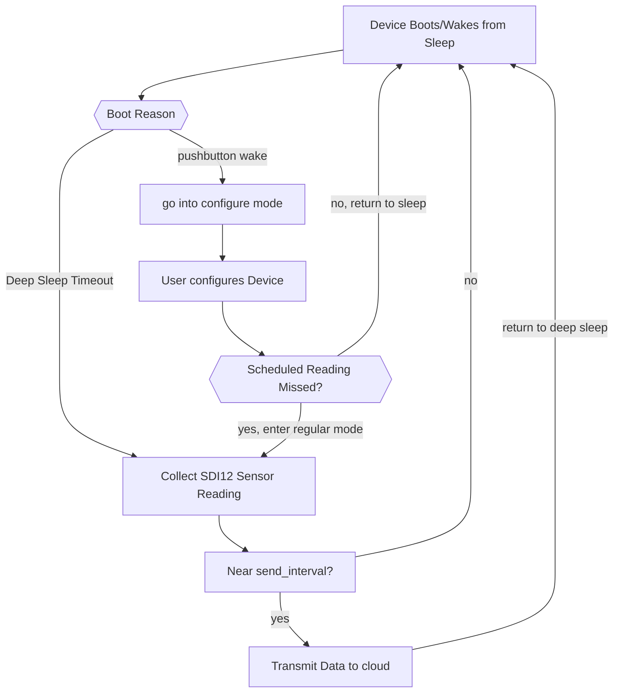
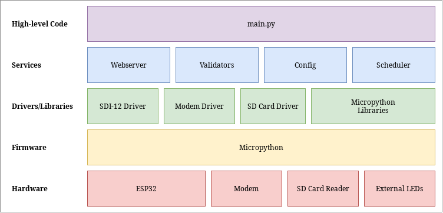

# Embedded Software Architecture

Constructing an efficient software architecture for the devices is
important for reliability, testing and ease of collaboration.
This section focusses on the high-level software design, including the modes of operation and web server design.
Readers are encouraged to refer to the [2020 hardware report](/docs/literature/Behrent2020FinalReport.pdf) for low-level device software design.

- [Embedded Software Architecture](#embedded-software-architecture)
  - [Constraints](#constraints)
  - [Modes of Operation](#modes-of-operation)
  - [Architecture Overview](#architecture-overview)
  - [Web Server Design](#web-server-design)
    - [Server-side vs Client Side Rendering](#server-side-vs-client-side-rendering)
    - [REST API](#rest-api)
  - [Configure Mode - Web Server Implementation](#configure-mode---web-server-implementation)

## Constraints

The design of the device software is constrained to suit the low-power hardware chosen for the project.
Specifically, the ESP32 microcontroller has 8MB of RAM, and 4MB of non-volatile "disk" (flash memory) space.
The RAM constraints may potentially be reduced to 100KB in the future to free up some hardware pins and reduce power usage.
Moreover, to obtain maximum power savings,
the device needs to be in "deep sleep" - extremely low power mode where nearly everything is turned off - for as long as possible.
The software needs to be designed around this.
In deep sleep mode, no code can run, so all the processing required should be done in batches before resuming deep sleep.

## Modes of Operation

The high-level software is split into two main logical "modes": `regular mode` and `configure mode`.

- `configure mode` is initiated by the user via pressing a push-button or activating a hall-effect sensor with a magnet.
  It starts a WiFi access point and the webserver which allows the user to modify configuration values of the device.
  Once the user has finished configuring the device, a pushbutton or time-out would return the device back to sleep, or into regular mode if the user was configuring the device when a scheduled reading was meant to take place.
- `regular mode` is the regular operation of the device.
  When the device boots up from deep sleep, it takes a reading of the SDI-12 sensor, and periodically transmits the data to IoT Central before going back to sleep.

This separation was chosen because it logically matches the two main use cases of the device - *Configuring the device* and *Monitoring the state of a river*, allowing for a workflow shown in the following figure:

## Architecture Overview

The figure below shows a stack-diagram overview of our multi-tiered device-code architecture, building upon the existing community-provided micropython firmware.
At the top level, the high level code is responsible for handling the "pipeline" of regular operation as well as enabling/disabling the webserver.
The high level code makes use of different "services" - logically grouped functions and classes for particular device functionality, such as the webserver or device configuration.
In turn, the services directly use community-provided libraries.
They also need to communicate with the hardware.
Low-level device drivers act as a translator between hardware devices and the high-level software, abstracting away the technical details and providing a common interface so that high-level code can be written independently of the specific hardware.
At the bottom layers, firmware compiles high-level python code into low-level bytecode which is run by the micropython virtual machine on the ESP32 hardware.
External hardware, such as the modem and SD Card reader, are communicated with via serial communication busses on the ESP32.

Designing the software in this way allows for multiple benefits:

- *Separation of concerns*: components in each layer should only
    communicate with adjacent layers.
    In theory, this decouples the
    components so that layers can be modified without affecting the rest
    of the stack.

- *Increased Collaboration*: By agreeing on shared interfaces between
    layers, one team member is able to work on the high-level software
    while the other can work on low-level code without fear of
    interfering with each-other.

- *Increased Testability*: Each layer can be tested in isolation,
    making it easier to perform unit and integration testing.

Other possible architectures were also considered: The best alternative, known as "feature oriented architecture", takes cues from Service-Oriented Architecture (SOA), a pattern commonly seen in the web-development industry.

In this style, each high-level logical component of the system is encapsulated into it's own "service" with it's own dependencies, effectively splitting the architecture shown above into columns rather than rows.
This style promotes loose coupling between the different modes of operation on the device, which allows for independent development of different features, as well as easier testing.
However, a feature-oriented style doesn't work particularly well in this context due to the high amount of shared resources.
Hardware device drivers, for example, must be a singleton: only one instance of the driver can exist.
This approach would work in a more modular hardware design - like with independent microcontrollers for separate functionality on the device - but for a proof-of-concept, this would only add needless complexity.

## Web Server Design

The Web Server - the *backend* - is responsible for serving up the Web App to the client - the *frontend*.
The web server is designed around a webserver library called [TinyWeb](https://github.com/belyalov/tinyweb), a lightweight, single-threaded HTTP server for Micropython.

Various other webserver libraries were researched and tested, including [MicroWebSrv](https://github.com/jczic/MicroWebSrv), [MicroWebSrv2](https://github.com/jczic/MicroWebSrv2) and [Picoweb](https://github.com/pfalcon/picoweb), but each had [major issues](/docs/research/software/mobile-app/microwebsrv-test/README.md) which limited their functionality.

### Server-side vs Client Side Rendering

Choosing whether to use server-side rendering or client-side rendering for the Web App was an important design decision.
Server side rendering (SSR) is when the server is responsible for creating the entire web page, and then sending that to the client.
If the page requires dynamic data (for example, results from a sensor reading), the server populates the page with dynamic data using a *template engine.* This method works well for normal webservers, because they usually have high compute capacity and are able to dynamically render multiple webpages at once.
 However, the low CPU and RAM constraints on the microcontroller hardware mean that building websites on the device would be both slow and power consuming.

Client-side rendering (CSR) is a newer approach made possible by modern frameworks such as [React](https://reactjs.org/), where the compilation of dynamic content and generation of the webpage is undertaken by the client web browser.
The webserver sends the static HTML and CSS to the browser, and the browser uses the webserver's API via asynchronous javascript calls to get the dynamic data.

This approach is preferred in this situation because it keeps the webserver resource demands on the device as light as possible.
The other major benefit is caching.
Caching with SSR is difficult on a microcontroller due to the resource constraints, and so the server needs to send the entire page every time.
A client, meanwhile, can cache repeated requests, which means subsequent configuration attempts only require getting the dynamic data.
This improves page loading times significantly and reduces the load on the webserver.

### REST API

The REST API endpoints are documented [here](webserver.md)

## Configure Mode - Web Server Implementation

One of the requirements for configure mode is to have it cancel with a physical button press, or a timeout in case the user forgets.
 Cancellation via button is performed by a hardware interrupt that cancels the asyncio webserver task and closes the event loop.
To cancel via timeout, a modification to the webserver is required.
This is implemented by a subclass of the Tinyweb server which contains a Watchdog timer, and overrides the server's `_handler()` method - responsible for handling incoming requests.
When a request is handled, the overridden method resets ("pats") the watchdog, and then passes control to the original parent method for actual handling.
If the watchdog times out, a callback method for shutting down the server is called.
Implementing the webserver this way meant that the original library code is preserved, and the modifications are visible at the "service" level.

The webserver implementation is built on the idea of *Resources* - arbitrary Python classes with methods defined for different HTTP request types, representing a logically defined object with it's own state and operations.
This is a fundamental aspect of RESTful design.
Whilst tinyweb supports python generators, Micropython doesn't distinguish between generators and asyncio coroutines.
We implemented a modification to the library to support coroutines in resources.

At the top level, resources are mapped to a URL.
However, the implementation of the mapping differed from the design - TinyWeb doesn't support nested endpoints, so the dynamic part of a URI must always be at the end.
For example, the resource URI `/config/sdi12/<sensor_name>/test` (where `<sensor_name>` is dynamic) would be invalid.
To get around this, the API was modified to place the action - "update, rename, test" etc - before the dynamic part.

Each resource that accepts user data needs to perform validation to ensure the configuration values are set correctly.
To do this, a generic [validation service](/software/device/embedded/src/services/validators.py) was written that could validate any arbitrary data, modelled on the validation functions of the Django webserver framework.
The service is capable of recursively validating nested JSON inputs, and is used extensively across the codebase to ensure data consistency.
