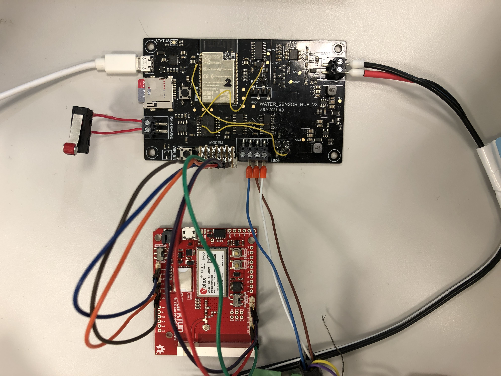

# Hardware setup

## Power supply

The device can be powered by two source, 5V from USB and 12V from battery or power supply, and it can switch automatically. But keep in mind that some function requires 12V to work.

- 5V
  - Serial communication with ESP32
  - SD card
  - Rain gauge counter
  - RTC
- 12V
  - SparkFun LTE Cat M1/NB-IoT Shield
  - SDI-12

### SDI-12

SDI-12 sensor colour-coding

- White: Power
- Brown: TX/RX
- Blue: GND

### Rain gauge

The rain gauge acts as a switch, so connect both sides of the switch to the terminal.

### SparkFun SARA-R4 LTE CAT M1/NB-IoT Shield

Mobile communication is provided by a u-blox SARA-R4 Series module [1] via a SparkFun LTE CAT M1/NB-IoT Shield [2]. The SparkFun Shields are available for purchase with Hologram Global IoT SIM cards [3] which allow connection to the local cellular network under a prepay plan [4]. Technical information on the shield, including schematics, is available from GitHub [5] and the schematics and hookup guide are available from this repository in the [docs/datasheets/SparkFun LTE Cat M1 NB-IoT Shield/](docs/datasheets/SparkFun LTE Cat M1 NB-IoT Shield/) directory. The u-blox  SARA-R4 Series Data Sheet, System Integration Manual, AT Command Manual and other technical information specific to the module used in the current revision of the data recorder are available from the [docs/datasheets/u-blox SARA-R4 Modem/](docs/datasheets/u-blox SARA-R4 Modem/) directory.

1. u-blox SARA-R4 Series <https://www.u-blox.com/en/product/sara-r4-series>
1. SARA-R4 <https://www.sparkfun.com/categories/tags/sara-r4>
1. SparkFun LTE CAT M1/NB-IoT Shield - SARA-R4 (with Hologram SIM Card) <https://www.sparkfun.com/products/15087>
1. Hologram <https://www.hologram.io>
1. SparkFun LTE CAT M1/NB-IoT Shield - SARA-R4 <https://github.com/sparkfun/LTE_Cat_M1_Shield>

#### Required Manual Setup

Plug in the SIM card and:

- set the `PWR_SEL` switch to `ARDUINO`;
- set the `SERIAL` switch to `HARD`.

Use wires to connect the SparkFun SARA-R4 Shield with the Revision 3.1 PCB according to the following pin map

| Revision 3.1 Board | SparkFun Shield | Description       |
| ------------------ | --------------- | ----------------- |
| 0V                 | GND             | Ground            |
| 3.3V               | IOREF           | Reference voltage |
| 5V                 | 5V              | Power             |
| TX                 | RX              | Data exchange     |
| RX                 | TX              | Data exchange     |
| EN                 | 5               | Enable            |
