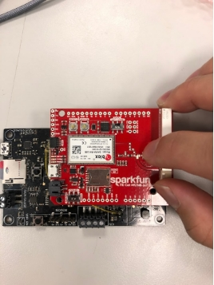
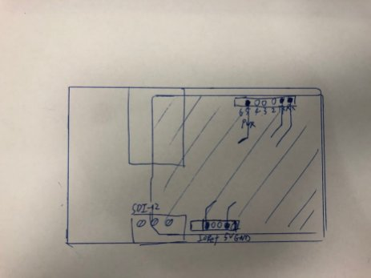
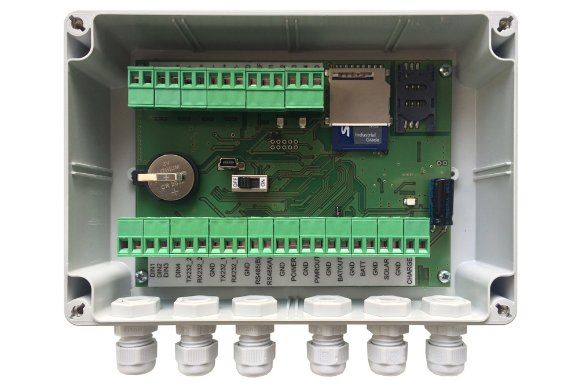

# Rev 3.0 PCB Review

The footprint for N-MOSFET didn’t match FDN361BN.

Affected component: Q501, Q502

The datasheet of FDN361BN can befound [here](https://www.onsemi.com/pdf/datasheet/fdn361bn-d.pdf).

Gate should be Pin 2 but the footprint is Pin 1.

Solution: update the footprint for the FDN361BN.

GPIO 34 and 35 are input only Pin and we use it for outputting control signal for SDI_EN and SDI_FOut.

Solution: Use GPIO23 and GPIO5

MUX output is high when powered up. This is not an issue when normal operating but we connect this pin to GPIO2 which is a strapping pin for esp32. It must be low or floating to getting into bootloader.

Solution: Remove MUX. Use IO expander to get count and control the counter.

Our client wants the rain data to have in 1min timestamp and the maximum rate the rain gauge can tip is 12tips/minute. So, 6-bits is enough to count.

Do you know what will happen to the battery fuel gauge if we reverse the polarity of the battery? Is there protection in the IC? Or the IC just don’t care?

Currently the I2C terminal uses mail header, could you change to female header?

We have decided not to surface mount the modem on the Rev4.0 but use the LTE shield from Sparkfun instead. It would be nice to have female header for the shield so we can stack the modem on the PCB without the terminal blocks.

Just avoid any confusion this is the TX/RX for the modem

|ESP32||Modem|
| :-: | :-: | :-: |
|Pin 27 / MOD_RX|\<-|D1 / RX|
|Pin 26 / MOD_TX|->|D0 / TX|

Note that the RX/TX in the modem is reversed.

I think I will still keep the USB to TTL circuit on Rev 4.0.

Remove button for WiFi enable. Use pin header for though hole hall effect sensor.

Only Green and Red LED is used, not connect blue LED. Because run out of GPIO.

Change part for the LED used in reverse polarity protection.

Consider this device is secure in a case some change maybe needed.

For example, the data logger below has:

- SD card socket is inward instead of outward.

- Micro usb socket face toward the user

- A switch to turn on/off the device

---
