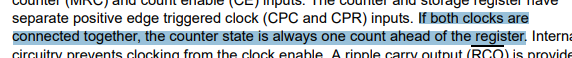

# Schematic review 2

## Rain Gauge Review

All the sensors should have 100nF caps for their 3v3 rails. Just make it a habit to do this for every IC.

Response: Added bypass caps

## Hall Sensor

How does the rain gauge work in operation. I see this is a hall sensor of some kind, are we needing to mount the device in proximity to a magnet? How strong is the magnet, and what orientation? Both are pretty important to the layout.

Looks like you don’t need that resistor on the output of the hall sensor.

Response:

- Hall sensor now change to reed switch to generate a pulse signal.
- The signal is normally on low.
- When a magnet present, the reed switch will open and 5V (High) signal gose to the counter.
- The resistors and cap are on the main board and need a extention wire to place the reed switch near the rain gauge.

## Counter

Worth noting the count will be one ahead because both inputs are connected on the counter as per datasheet below. I didn’t see anything so say we need CPR, could use a 0R between CPC and CPR?

Response: I find a example wireing for the counter online. It shows the CPC and CPR are connected together. Since I have the counter IC, I will test it later.

I didn’t see anything to say that /CE could be left floating, you should ground it to be sure.

Response: CE is STOP bit

It might be worth putting a pull-up on the /MRC line, to be sure we don’t accidently reset the count when the micro is off as the reset is active low.

Response: Pull up resistor added

## Shift Register

I’m not sure I understand why there is a shift register at all. The counter could be connected to a MUX, so all 8 inputs down to 1 GPIO pin. Then the microcontroller can quickly switch through the MUX inputs to get the binary count. Was there another purpose?

Why is /CE connected to 3V3, as it looks like you intend to use the CP input?

Response: Shift register has removed and now using 8bit mux.

## Battery Gauge

Looks like this is just a copy of the circuit diagram from the datasheet, so it’s hard to review without actual component values i.e. the Zener, MOSFETS, resistors, etc. However I would say, unless we want a thermistor on the battery to monitor temperature, the ALERT and circuitry is redundant. Good to have if you are planning on having a thermistor on the battery.

Looks like these are the wrong way around. Datasheet diagram also has them around the other way.

Pick a voltage divider ratio such that: 14V * Rbot/(Rtop+Rbot) = 0.9V

This is a better schematic to use, though note it’s for a 5V battery.

Response:

- My schematic follows the Multi-cell one. With voltage devider resistor = 16.5k ( 17000mV – 900mV)/900mV = 295.2k = 300k

- LED display circuit and Alert is not needed thus not in the schematic

- I think there are more components can be remove since I don’t need 2.5V(REGIN, REG25) but I am not sure. Could you tell me what can be removed?

- The sensor resistor value have not been determined. I am not sure how to calculated the resistence for that.

- There is a footnote for optimize for required voltage and current. I don’t know what that means. Something to do with R2 R3 R4?

---
